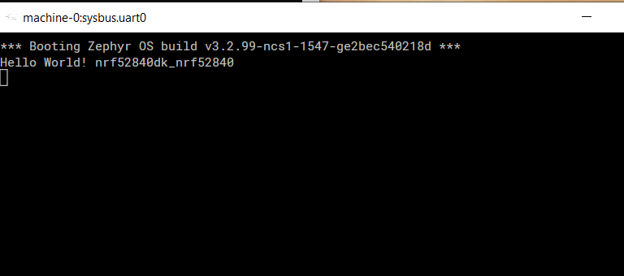

# D5_challenge
Code for D5 Challenge

## Option 3 : Simulate All The Things was selected for practical challenge.

The following steps were followed to complete the task:

### 1. Setup development environment for nRF52840

   - Download and install nRF Command Line Tools
   - Download and install nRF Connect for Desktop
   - Install Toolchain Manager 
      - nRF Connect SDK v2.2.99-dev3 was installed  
   - Download and install VS Code 
   - Install VS Code extentions
      - all recommended VS Code extentions for nRF applications were installed
   - Configure nRF Connect for VS Code by selecting nRF Connect SDK and toolchain
   
### 2. Build Hello World program

   - Create new Application in VS Code
   - Select location and name for the application
      - zephyr/samples/hello_world was selected
   - Select nrf52840 device
   - build application to generate zephyr.elf file
   
### 3. Inctall Renode
  - Download and install renode from github repository
    
### 4. Run Hello World program in renode.
Execute following commands in the renode monitor window:
  - mach create
  - machine LoadPlatformDescription @platforms/cpus/nrf52840.repl
  - sysbus LoadELF @build/zephir/zephir.elf
  - showAnalyzer sysbus.uart0
  - start

Hallo World string is sent on the uart0  as shown on this picture:

    
